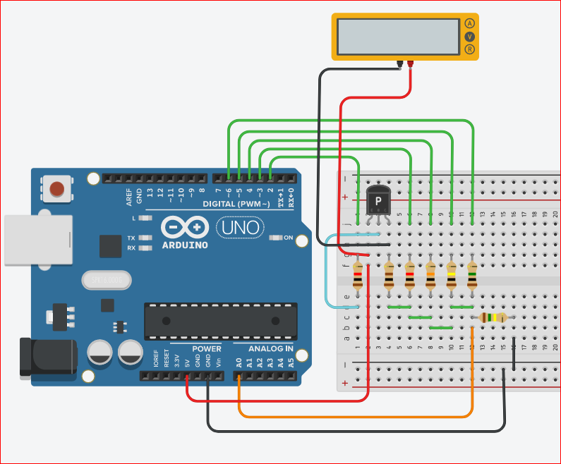

# ArduOhm
Roberto De Colle ver. 0.2
22.4.2024

Ohmmeter with automatic scale with Arduino

Use a voltage divider with known R1 and unknown Rx as in the picture.

 
Voltage on Rx is read from AnalogRead(A0) and converted in volt.

## Problem
With a fix R1 value (as 1K), the Rx value can be not accurate enough if Rx << R1 or Rx >> R1.
Therefore we need to change measurement scale changing the R1 value to be more similar to Rx value. 
## Solution
This can be made using 5 different R1 values and therefore 5 different measurement scale.

 

In pic you see 5 different "R1" resistor, 100, 1K, 10K, 100K, 1M.
5 Output pins of Arduino put 5V on the right R1, but just one output at a time can be on +5V otherwise all R1 will be 
in parallel as one resistor.
This is achieved setting all output pin as input pin (equivalent R is great and therefore no resistor is connected to 5V) and then just one pin at a time is setted as output e brought to +5V.
This make an automatic scale to use the suitable value for R1.
## Another problem
By measuring little values of Rx, the right scale has a R1 = 100; with little value of R1+Rx the current provided from Arduino is too high (ca. 50 mA or more).
Therefore we use a PNP transistor to request just a few little current from pin.
In order of turning on the PNP transistor, we need to set output pin LOW instead of HIGH as for the other scales.
