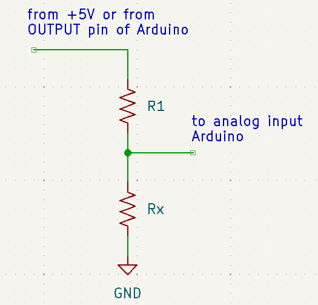

# ArduOhm
Roberto De Colle ver. 0.2
22.4.2024

Ohmmeter with automatic scale with Arduino

Use a voltage divider with known R1 and unknown Rx as in the picture.  
 
Voltage on Rx is read from AnalogRead(A0) and converted in volt. 
## Problem
With a fix R1 value (as 1K), the Rx value can be not accurate enough if Rx << R1 or Rx >> R1.
Therefore we need to change measurement scale changing the R1 value to be more similar to Rx value. 
## Solution
This can be made automatic using 5 different R1 values and therefore 5 different measurement scale.
